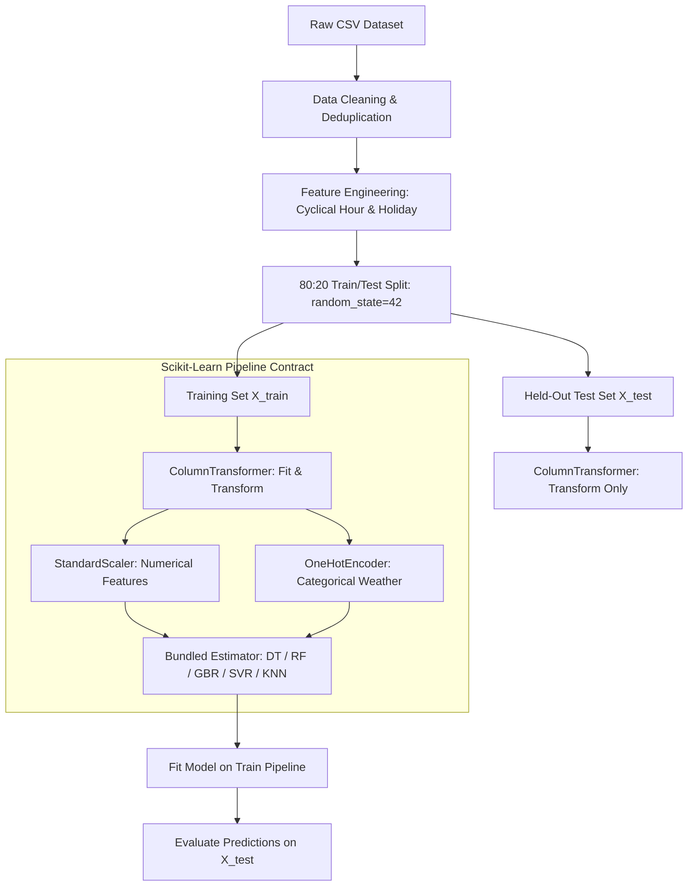

<div align="center">

# 🚗 23CSE301 — Machine Learning Capstone | Review 1

**Comprehensive Dual-Track Machine Learning Pipeline: Metro Interstate Traffic Regression & Bank Marketing Classification**

[](https://www.python.org/)
[](https://scikit-learn.org/)
[](https://pandas.pydata.org/)
[]()

[Project Overview](#-1-project-overview--dual-track-summary) •
[Datasets & Feature Engineering](#-2-datasets--feature-engineering) •
[Pipeline Architecture](#-3-pipeline-architecture--leakage-guard) •
[Regression Model Benchmarks](#-4-regression-track-results--benchmarks) •
[Classification Track](#-5-classification-track-part-a) •
[Quick Start](#-6-installation--quick-start)

---

</div>

## 📌 1. Project Overview & Dual-Track Summary

This repository houses the complete machine learning codebase for **Course 23CSE301 Capstone (Review 1 Evaluation)**. The project evaluates predictive modeling across two foundational paradigms:

1. **Regression Track:** Predicting hourly interstate traffic volume on I-94 using non-linear algorithms, distance-based estimators, and gradient-boosted decision trees.
2. **Classification Track (Part A):** Predicting bank term deposit subscriptions using baseline and probabilistic classifiers while preventing data leakage.

### 📊 Quick Track Comparison

| Metric / Attribute | Track 1: Regression (Traffic Volume) | Track 2: Classification (Bank Term Deposit) |
| :--- | :--- | :--- |
| **Primary Dataset** | UCI Metro Interstate Traffic Volume | UCI Bank Marketing (`bank-full.csv`) |
| **Target Variable** | `traffic_volume` (Continuous, vehicles/hr) | `y` (Binary: `yes` $\rightarrow$ 1, `no` $\rightarrow$ 0) |
| **Cleaned Sample Size** | **40,565 rows** (after deduplication & filtering) | **45,211 rows** |
| **Predictor Features** | 12 features (6 raw + 6 engineered) | 15 features (after leakage exclusion) |
| **Primary Evaluation Metric** | $R^2$ Score, RMSE, MAE | Weighted $F_1$, Accuracy, ROC-AUC |
| **Best Model & Score** | **Gradient Boosting Regressor ($R^2 = 0.9460$)** | Baseline Classifiers (Review 1) |

---

## 🧹 2. Datasets & Feature Engineering

### 🚗 Track 1: Metro Interstate Traffic Volume (Regression)
- **Source:** [UCI ML Repository (Dataset #492)](https://archive.ics.uci.edu/dataset/492/metro+interstate+traffic+volume) / Kaggle Mirror.
- **Target Variable:** `traffic_volume` — Hourly I-94 Westbound traffic volume (0 to ~7,280 vehicles/hr).
- **Physical Data Quirks & Explicit Solutions:**
  1. **Duplicate Hourly Logs:** Deduplicated on `date_time` (keeping the first entry), removing 7,629 redundant logs.
  2. **Temperature Outlier Correction:** Filtered out 10 physically impossible `temp = 0 K` (-273.15 °C) sensor measurement errors.
  3. **Binary Holiday Encoding:** Replaced text `holiday` column with a binary `is_holiday` feature (1 for national/state holidays, 0 for `'None'`).
  4. **Cyclical & Temporal Feature Extraction:** Extracted `hour`, `day_of_week`, `month`, `is_weekend`, and cyclical trigonometric transformations:
     $$\text{hour\_sin} = \sin\left(\frac{2\pi \cdot \text{hour}}{24}\right), \quad \text{hour\_cos} = \cos\left(\frac{2\pi \cdot \text{hour}}{24}\right)$$

### 🏦 Track 2: Bank Marketing Term Deposit (Classification — Part A)
- **Source:** UCI Bank Marketing Dataset (`bank-full.csv`, semicolon-delimited).
- **Target Variable:** `y` — Binary subscription indicator (`yes` vs `no`).
- **Data Leakage Guard:** `duration` is **strictly excluded** from predictors prior to modeling because call duration is unknown before a telemarketing call finishes.

---

## ⚙️ 3. Pipeline Architecture & Leakage Guard

> [!IMPORTANT]
> **Strict Zero Data Leakage Guarantee:**
> All feature standardizers (`StandardScaler`) and categorical encoders (`OneHotEncoder(handle_unknown='ignore')`) are fitted **strictly on the 80% training set** (`X_train`) within scikit-learn `Pipeline` and `ColumnTransformer` constructs. Test data (`X_test`) is exclusively transformed using parameters learned from training data.



---

## 📈 4. Regression Track Results & Benchmarks

Evaluating 5 non-linear algorithms on the held-out test split (**8,113 samples**), sorted by $R^2$ score descending:

| Rank | Algorithm | Test $R^2$ | RMSE (veh/hr) | MAE (veh/hr) | 5-Fold Cross-Val $R^2$ | Best Hyperparameters |
| :---: | :--- | :---: | :---: | :---: | :---: | :--- |
| 🥇 | **Gradient Boosting Regressor** | **0.9460** | **459.26** | **275.48** | **$0.9437 \pm 0.0019$** | `learning_rate=0.2`, `n_estimators=200` |
| 🥈 | **Random Forest Regressor** | **0.9454** | **461.74** | **266.93** | **$0.9413 \pm 0.0016$** | `n_estimators=100`, `max_depth=10` |
| 🥉 | **Decision Tree Regressor** | **0.9396** | **485.70** | **284.42** | — | `max_depth=8` |
| 4 | **K-Nearest Neighbors (KNN)** | **0.9286** | **528.02** | **338.88** | — | `n_neighbors=9` (with scaled features) |
| 5 | **Support Vector Regressor (SVR)** | **0.8261** | **824.15** | **555.43** | — | `kernel='rbf'`, `C=50.0` |

> [!TIP]
> **Key Analytical Takeaway:**
> Gradient Boosting and Random Forest excel because tree ensembles naturally model non-linear 24-hour commuter spikes and weather interactions. Hyperparameter tuning improved SVR performance drastically from baseline $R^2 = 0.1814 \rightarrow 0.8261$ (+0.6447 gain).

---

## 🔬 5. Classification Track (Part A)

Part A covers baseline classification algorithms for Review 1:
1. **Logistic Regression:** Linear classifier baseline (`solver='lbfgs'`, `max_iter=1000`).
2. **K-Nearest Neighbors (KNN):** Distance-based classification ($k=5$) with scaled features.
3. **Gaussian Naive Bayes:** Probabilistic modeling with dense matrix preprocessing.
4. **Decision Tree Classifier:** Tree-based split control with Gini impurity tuning.
5. **Support Vector Classifier (SVC):** Standardized RBF kernel classifier with probability estimates.

---

## 📁 6. Repository Structure

```text
ml_capstone/
├── README.md                           # Master Project Documentation
├── requirements.txt                    # Pin-compatible Python dependencies
├── Metro_Interstate_Traffic_Volume.csv # Local dataset copy
├── data/
│   ├── Metro_Interstate_Traffic_Volume.csv # UCI Traffic dataset
│   └── bank-full.csv                  # Bank Marketing dataset (semicolon-delimited)
└── notebooks/
    ├── regression.ipynb                # Regression Track (10 Models, Pre-rendered)
    └── classification.ipynb            # Classification Track (Part A — Review 1)
```

---

## 💻 7. Installation & Quick Start

### 1️⃣ Clone & Install Dependencies
```bash
git clone https://github.com/SH-Nihil-Mukkesh-25/ml_capstone.git
cd ml_capstone

# Install required packages
pip install -r requirements.txt
```

### 2️⃣ Launch Jupyter Notebooks
```bash
jupyter notebook
```
Navigate to `notebooks/regression.ipynb` and select **Kernel $\rightarrow$ Restart & Run All**.

---

<div align="center">

*B.Tech CSE — 23CSE301 Machine Learning Capstone | Review 1 Submission*

</div>
