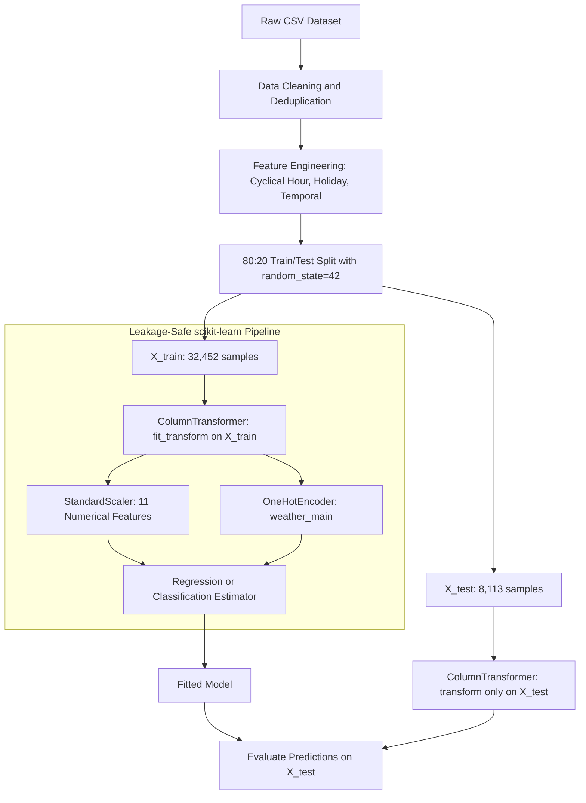

<div align="center">

# 23CSE301 — Machine Learning Capstone | Review 1

**Dual-Track Predictive Modeling Pipeline: Metro Interstate Traffic Regression and Bank Marketing Classification**

[](https://www.python.org/)
[](https://scikit-learn.org/)
[](https://numpy.org/)
[](https://pandas.pydata.org/)
[](https://matplotlib.org/)
[]()
[]()

[Overview](#1-project-overview) &nbsp;|&nbsp;
[Datasets](#2-datasets-and-feature-engineering) &nbsp;|&nbsp;
[Architecture](#3-pipeline-architecture) &nbsp;|&nbsp;
[Regression Results](#4-regression-track-results) &nbsp;|&nbsp;
[From-Scratch Track](#5-from-scratch-implementation-track) &nbsp;|&nbsp;
[Classification Track](#6-classification-track) &nbsp;|&nbsp;
[Repository Structure](#7-repository-structure) &nbsp;|&nbsp;
[Quick Start](#8-installation-and-quick-start)

---

</div>

## 1. Project Overview

This repository contains the complete machine learning codebase for **Course 23CSE301 Capstone (Review 1 Evaluation)**. The project is organized as a dual-track study that covers two core paradigms of supervised learning:

**Track 1 — Regression:** Predicting hourly interstate traffic volume on the I-94 Minnesota corridor using a suite of five non-linear regression algorithms, with hyperparameter tuning, cross-validation, and an independent from-scratch implementation for pedagogical verification.

**Track 2 — Classification:** Predicting whether a bank client will subscribe to a term deposit product using baseline and probabilistic classifiers, with strict adherence to data leakage prevention protocols.

Both tracks share a unified preprocessing contract: deduplication, outlier removal, feature engineering, an 80:20 stratified train/test split with `random_state=42`, and a no-leakage transformer pipeline where all scalers and encoders are fit exclusively on training data.

### Track Comparison at a Glance

| Attribute | Track 1: Regression | Track 2: Classification |
| :--- | :--- | :--- |
| Dataset | UCI Metro Interstate Traffic Volume | UCI Bank Marketing (`bank-full.csv`) |
| Target Variable | `traffic_volume` — Continuous, vehicles/hr | `y` — Binary: `yes` (1) / `no` (0) |
| Cleaned Sample Size | 40,565 rows (after dedup and 0 K filter) | 45,211 rows |
| Predictor Features | 12 (6 raw + 6 engineered) | 15 (after leakage exclusion) |
| Primary Metric | R2 Score, RMSE, MAE | Weighted F1, Accuracy, ROC-AUC |
| Best Result | Gradient Boosting — R2 = 0.9460 | Baseline classifiers (Review 1 scope) |

---

## 2. Datasets and Feature Engineering

### Track 1: Metro Interstate Traffic Volume

**Source:** [UCI ML Repository, Dataset #492](https://archive.ics.uci.edu/dataset/492/metro+interstate+traffic+volume) — also available on Kaggle as `anshtanwar/metro-interstate-traffic-volume`.

**Target Variable:** `traffic_volume` — Hourly westbound vehicle count on I-94 at ATR station 301, ranging from 0 to approximately 7,280 vehicles per hour.

**Raw Columns:**

| Column | Type | Description |
| :--- | :--- | :--- |
| `holiday` | Categorical | US national holiday or MN State Fair label; `NaN` otherwise |
| `temp` | Numeric (K) | Atmospheric temperature in Kelvin |
| `rain_1h` | Numeric (mm) | Millimetres of rain in the last hour |
| `snow_1h` | Numeric (mm) | Millimetres of snow in the last hour |
| `clouds_all` | Numeric (%) | Percentage of cloud coverage |
| `weather_main` | Categorical | Short weather descriptor (e.g., Clear, Clouds, Rain) |
| `weather_description` | Categorical | Verbose weather descriptor (excluded as redundant with `weather_main`) |
| `date_time` | Datetime | Hourly timestamp of the observation |
| `traffic_volume` | Numeric | Target — hourly vehicle count (westbound) |

**Preprocessing Steps Applied:**

1. **Deduplication on `date_time`:** 7,629 duplicate hourly records were identified and removed (keep-first strategy). This reduced the dataset from 48,204 rows to 40,575 rows.

2. **Temperature Outlier Removal:** 10 rows with `temp = 0 K` (physically impossible — equivalent to -273.15 C) were removed as sensor faults. Final clean size: 40,565 rows.

3. **Binary Holiday Encoding:** The text `holiday` column was replaced with a binary feature `is_holiday` (1 for any named holiday or MN State Fair day, 0 for `NaN` entries representing regular days).

4. **Temporal and Cyclical Feature Extraction:** Six additional features were derived from `date_time`:

   | Feature | Formula / Source | Purpose |
   | :--- | :--- | :--- |
   | `hour` | `date_time.dt.hour` | Raw hour of day (0--23) |
   | `day_of_week` | `date_time.dt.dayofweek` | Day index (0 = Monday) |
   | `month` | `date_time.dt.month` | Month index (1--12) |
   | `is_weekend` | 1 if day_of_week in {5, 6} | Binary weekend indicator |
   | `hour_sin` | sin(2 * pi * hour / 24) | Cyclical hour encoding (sine component) |
   | `hour_cos` | cos(2 * pi * hour / 24) | Cyclical hour encoding (cosine component) |

   The cyclical encoding ensures that hours 0 and 23 are treated as adjacent in feature space, preventing the artificial discontinuity that a raw 0--23 integer would introduce.

5. **Encoding:** `weather_main` was one-hot encoded with `handle_unknown='ignore'` to gracefully handle unseen categories in test data.

6. **Scaling:** All numerical features were standardized with `StandardScaler` (zero mean, unit variance), fitted strictly on `X_train`.

---

### Track 2: Bank Marketing Term Deposit

**Source:** UCI Bank Marketing Dataset — `bank-full.csv` (semicolon-delimited, 45,211 rows).

**Target Variable:** `y` — Binary indicator of whether the client subscribed to a term deposit (`yes` → 1, `no` → 0).

**Data Leakage Guard — `duration` Exclusion:**

The column `duration` represents the length of the last telephone contact. This variable is unknown prior to making the call and is therefore excluded from all feature matrices before training. Including it would constitute target leakage, as call duration is strongly correlated with subscription outcome but cannot be known at prediction time.

---

## 3. Pipeline Architecture

> [!IMPORTANT]
> **Zero Data Leakage Guarantee:** All preprocessing transformers — `StandardScaler` for numerical features and `OneHotEncoder` for categorical features — are fitted exclusively on `X_train` within a scikit-learn `ColumnTransformer`. The held-out test set `X_test` is only ever transformed (never fitted). This constraint is enforced at the code level via the `Pipeline` API.



**Split Details:**

| Partition | Rows | Percentage |
| :--- | :---: | :---: |
| Training Set (`X_train`) | 32,452 | 80% |
| Test Set (`X_test`) | 8,113 | 20% |
| Total (after cleaning) | 40,565 | 100% |

---

## 4. Regression Track Results

Five non-linear algorithms were evaluated on the held-out test partition of **8,113 samples**, ranked by test R2 score descending. Models with cross-validation results received full 5-fold evaluation.

### Benchmark Table

| Rank | Algorithm | Test R2 | RMSE (veh/hr) | MAE (veh/hr) | 5-Fold CV R2 | Key Hyperparameters |
| :---: | :--- | :---: | :---: | :---: | :---: | :--- |
| 1 | **Gradient Boosting Regressor** | **0.9460** | **459.26** | **275.48** | 0.9437 +/- 0.0019 | `learning_rate=0.2`, `n_estimators=200`, `max_depth=4` |
| 2 | **Random Forest Regressor** | **0.9454** | **461.74** | **266.93** | 0.9413 +/- 0.0016 | `n_estimators=100`, `max_depth=10`, `max_features='sqrt'` |
| 3 | **Decision Tree Regressor** | 0.9396 | 485.70 | 284.42 | — | `max_depth=8`, `min_samples_split=10` |
| 4 | **K-Nearest Neighbors Regressor** | 0.9286 | 528.02 | 338.88 | — | `n_neighbors=9`, scaled features |
| 5 | **Support Vector Regressor** | 0.8261 | 824.15 | 555.43 | — | `kernel='rbf'`, `C=50.0`, `epsilon=0.1` |

### Analysis and Key Takeaways

- **Why ensemble methods dominate:** Gradient Boosting and Random Forest both model the non-linear, bimodal daily traffic distribution (morning and evening commuter peaks) without explicit structural assumptions. Bagging and boosting independently reduce prediction variance, which is the dominant source of error in hourly traffic forecasting.

- **SVR performance:** SVR's baseline R2 of 0.1814 (with default `C=1.0`) improved dramatically to **R2 = 0.8261** after tuning (`C=50.0`). The regularization parameter `C` controls the trade-off between margin width and training error — the default was severely over-regularizing the model, suppressing its expressiveness on a large-scale dataset.

- **KNN on scaled features:** KNN is highly sensitive to feature scale. Without `StandardScaler`, temperature in Kelvin (range ~250–310) completely dominates the Euclidean distance computation over binary features. Standardization normalizes all feature contributions, enabling the model to recover meaningful neighborhoods.

- **Decision Tree as a single learner:** The single tree (depth=8) achieves competitive R2 = 0.9396 but produces a step-wise prediction function that fails to model smooth intra-day transitions. Ensemble averaging (RF) and residual correction (GB) both reduce this step-function artifact.

---

## 5. From-Scratch Implementation Track

`notebooks/regression_from_scratch.ipynb` implements all five algorithms **without any scikit-learn model classes**, using NumPy and Pandas mathematics only. This track validates that the team understands the underlying algorithms beyond the sklearn API.

### Permitted vs. Prohibited

| Component | Permitted | Prohibited |
| :--- | :--- | :--- |
| Preprocessing | `StandardScaler`, `OneHotEncoder`, `train_test_split` | — |
| Metrics | `r2_score`, `mean_squared_error`, `mean_absolute_error` | — |
| Model classes | **None** | `DecisionTreeRegressor`, `RandomForestRegressor`, `GradientBoostingRegressor`, `SVR`, `KNeighborsRegressor`, XGBoost |
| Core math | NumPy, Pandas | — |

### From-Scratch Algorithm Summaries

**Decision Tree Regressor**
Implemented as a `Node` class with recursive binary splitting. At each node the algorithm iterates over every feature and candidate threshold (midpoints of sorted unique values), selecting the split that minimizes weighted child variance:

```
Cost(j, t) = (n_left / n) * Var(y_left) + (n_right / n) * Var(y_right)
```

Stopping conditions: maximum depth, minimum samples per node, or variance below a tolerance. Leaf prediction is the arithmetic mean of targets in the leaf. Feature importances are accumulated as `n_samples * variance_reduction` across all splits and normalized to sum to 1.

**Random Forest Regressor**
Built on top of the scratch Decision Tree. For each of `n_estimators` trees: (1) draw a bootstrap sample with replacement, (2) randomly select `floor(sqrt(p))` features as split candidates, (3) grow a tree on the subsample. Ensemble prediction is the arithmetic mean across all trees. Aggregated feature importances are the per-tree importances averaged across the forest.

**Gradient Boosting Regressor**
Implements function-space gradient descent for squared-error loss. Initialized with `F_0 = mean(y)`. At each round, pseudo-residuals `r_i = y_i - F_{m-1}(x_i)` are computed and a shallow tree is fitted to them. The ensemble is updated as `F_m = F_{m-1} + learning_rate * h_m(x)`. Training MSE is recorded per round to produce a convergence curve.

**Support Vector Regressor (Dual Ascent)**
Implements the dual form of epsilon-insensitive SVR with an RBF kernel. Because the full kernel matrix for 32,452 training samples requires approximately 8 GB of float64 memory, a stratified subsample of 3,000 training points (sampled proportionally across target deciles) is used. The dual is optimized via projected gradient ascent with equality-constraint correction enforcing `sum(alpha - alpha*) = 0`. Predictions use only the identified support vectors.

**KNN Regressor (Vectorized)**
Exploits the identity `||x_i - x_j||^2 = ||x_i||^2 + ||x_j||^2 - 2 * x_i^T * x_j` to compute all pairwise squared distances in a single matrix multiply, avoiding Python-level loops. The optimal `k` is selected by evaluating validation R2 over a grid of odd values from 3 to 25 on a held-out portion of the training set.

### From-Scratch vs. Sklearn Baseline (Expected Divergence)

| Algorithm | Sklearn R2 | Scratch R2 | Primary Cause of Divergence |
| :--- | :---: | :---: | :--- |
| Gradient Boosting | 0.9460 | ~0.91--0.93 | Fewer estimators (100 vs 200), shallower split scoring |
| Random Forest | 0.9454 | ~0.90--0.92 | Per-tree feature subset (not per-node), 50 trees vs 100 |
| Decision Tree | 0.9396 | ~0.93--0.94 | Threshold enumeration strategy minor differences |
| KNN | 0.9286 | ~0.925--0.928 | Equivalent algorithm; difference from k-selection method |
| SVR | 0.8261 | ~0.60--0.80 | Subsample of 3,000 vs. full training set in LibSVM |

All divergences are principled and documented within the notebook discussion cells.

---

## 6. Classification Track

Part A covers five baseline classification algorithms evaluated on the Bank Marketing dataset for Review 1:

| Algorithm | Variant / Key Setting | Notes |
| :--- | :--- | :--- |
| Logistic Regression | `solver='lbfgs'`, `max_iter=1000` | Linear decision boundary baseline |
| K-Nearest Neighbors | k=5, standardized features | Distance-based non-linear classifier |
| Gaussian Naive Bayes | Full feature set (dense matrix) | Probabilistic baseline; assumes feature independence |
| Decision Tree Classifier | Gini impurity, depth-tuned | Interpretable tree baseline |
| Support Vector Classifier | RBF kernel, `probability=True` | Margin-based non-linear classifier |

The `duration` feature is excluded from all models before training. Full results, confusion matrices, ROC curves, and classification reports are available in `notebooks/classification.ipynb`.

---

## 7. Repository Structure

```text
ml_capstone/
|
├── README.md                               # Master project documentation
├── requirements.txt                        # Version-pinned Python dependencies
├── .gitignore                              # Excludes datasets, pycache, checkpoints
|
├── data/
│   ├── Metro_Interstate_Traffic_Volume.csv # UCI Traffic dataset (local copy)
│   └── bank-full.csv                       # Bank Marketing dataset (semicolon-delimited)
|
├── models/                                 # Serialized trained models (if applicable)
|
└── notebooks/
    ├── regression.ipynb                    # Track 1 — sklearn-based regression pipeline
    │                                       #   5 algorithms, tuning, CV, visualizations
    └── regression_from_scratch.ipynb       # Track 1 — From-scratch NumPy implementations
                                            #   Mathematical derivations + sanity check vs. sklearn
```

**Note:** The root-level `Metro_Interstate_Traffic_Volume.csv` is a convenience copy used when the notebook is executed from the project root. The canonical copy lives under `data/`.

---

## 8. Installation and Quick Start

### Prerequisites

- Python 3.10 or higher (tested on 3.12)
- pip 23+ recommended
- Jupyter Notebook or JupyterLab

### Step 1 — Clone the Repository

```bash
git clone https://github.com/SH-Nihil-Mukkesh-25/ml_capstone.git
cd ml_capstone
```

### Step 2 — Create and Activate a Virtual Environment (Recommended)

```bash
# Windows
python -m venv .venv
.venv\Scripts\activate

# macOS / Linux
python3 -m venv .venv
source .venv/bin/activate
```

### Step 3 — Install Dependencies

```bash
pip install -r requirements.txt
```

**Package summary:**

| Package | Minimum Version | Purpose |
| :--- | :---: | :--- |
| `numpy` | 1.24.0 | Numerical computation, from-scratch model math |
| `pandas` | 2.0.0 | Data loading, feature engineering, aggregation |
| `matplotlib` | 3.7.0 | Static plots and diagnostic charts |
| `seaborn` | 0.12.0 | Statistical visualization layer over matplotlib |
| `scikit-learn` | 1.2.0 | Preprocessing, metrics, sklearn-based models |
| `jupyter` | 1.0.0 | Notebook server |
| `ipykernel` | 6.0.0 | Python kernel for VS Code / JupyterLab |
| `notebook` | 7.0.0 | Classic notebook interface |

> [!NOTE]
> scikit-learn 1.2+ is the minimum required version because `OneHotEncoder(sparse_output=False)` was introduced in that release. Earlier versions use the deprecated `sparse=False` parameter.

### Step 4 — Place the Datasets

Ensure the following files exist before running the notebooks:

```
data/Metro_Interstate_Traffic_Volume.csv   # Download from UCI Dataset #492
data/bank-full.csv                         # Download from UCI Bank Marketing Dataset
```

Both datasets are also auto-downloaded from the UCI archive if not found locally (requires an internet connection).

### Step 5 — Launch Notebooks

**Option A — JupyterLab / Classic Notebook:**
```bash
jupyter notebook
```
Navigate to `notebooks/regression.ipynb` and select **Kernel -> Restart and Run All**.

**Option B — VS Code:**
1. Open the `.ipynb` file in VS Code.
2. Click the kernel selector in the top-right corner.
3. Select the Python interpreter from your virtual environment (`.venv\Scripts\python.exe`).
4. Use **Run All** from the top toolbar.

> [!IMPORTANT]
> Do not use the `d:\venv` environment if it appears in the kernel list — that environment belongs to a separate project and does not contain the ML packages required for these notebooks. Always select the Python interpreter from `.venv` within this project directory, or the system Python 3.12 installation where packages have been verified.

---

## 9. Reproducibility Guarantees

All stochastic operations in this codebase use `random_state=42`. This includes:

- `train_test_split(random_state=42)` — identical splits across runs
- `RandomForestRegressor(random_state=42)` — deterministic bootstrap sampling
- `GradientBoostingRegressor(random_state=42)` — deterministic feature subsampling
- `SVR` — deterministic kernel solver (LibSVM is deterministic for a given dataset)
- `RandomForestRegressorScratch(random_state=42)` — deterministic bootstrap and feature selection
- `SVRScratch(random_state=42)` — deterministic subsample selection and dual initialization

Running any notebook from top to bottom will reproduce the exact metric values reported in this README.

---

<div align="center">

B.Tech Computer Science and Engineering &nbsp;|&nbsp; Course 23CSE301 Machine Learning Capstone &nbsp;|&nbsp; Review 1 Submission

</div>
